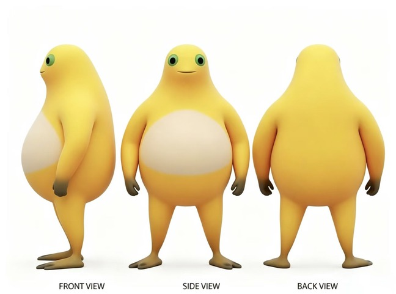

# 奶蛙量产工厂 · AutoNaiwa Studio

> 一个跑在你自己电脑上的「奶蛙」量产工具：选好风格标签或直接一句话描述，接上你自己的生图 API Key，批量生成统一的奶蛙表情包角色图，产物自动进本地图库。

整个应用是**纯静态前端 + 一个 Python 启动器**，没有构建步骤、没有 npm 依赖、不需要后端服务器。API Key 只存在你当前浏览器的会话里，不上传、不落盘。

<p align="center">
  
  
</p>

---

## 特性

- **一次出多只**：生成数量支持 1–8，一次排队批量出图。
- **36 个预设角色配方**：分成「职业与生活角色 / 打工人情绪包 / 校园与运动 / 美食与小店 / 节日表情包 / 国风古装 / 未来科幻 / 互联网抽象梗」8 组，点下拉就能挑。
- **自定义奶娃**：分项模式可从 15 种职业 × 14 种服装 × 12 种配饰 × 8 种动作 × 8 种表情里自由组合，也能直接写一句话交给 Prompt Compiler。
- **抽象程度滑杆**：0–100 调节「像正经角色」还是「像离谱梗图」。
- **Prompt 预览可复制**：生成前先看完整的英文 Prompt，满意再发车，也方便你搬到别处用。
- **可换角色底图**：默认用内置奶蛙基底，也能上传你自己的角色图做图生图参考。
- **本地图库**：生成结果可以一键存进浏览器本地图库，随时回看、复制配方继续 Remix、或下载到本地。
- **8 家服务商开箱可填**：OpenAI、硅基流动、阿里云百炼、火山方舟、智谱、MiniMax、腾讯 TokenHub，以及任意 OpenAI 兼容中转。

## 快速开始

### 环境要求

- **Windows**（启动脚本为 `.bat` / `.vbs`）
- **Python 3**（只需标准库：`tkinter` + `http.server`，无需 `pip install`）

### 启动

双击任意一个即可：

| 方式 | 说明 |
| --- | --- |
| `启动奶蛙工厂.vbs` | **推荐**。静默启动，不弹黑框，再自动打开页面 |
| `启动奶蛙工厂.bat` | 同上，但会留一个控制台窗口 |
| `naiwa-launcher.pyw` | 直接运行 Python 启动器（等价于上面两个） |

`start-naiwa.*` 与 `启动奶蛙工厂.*` 内容完全一致，中英文名各留一份，看你顺手。

启动器会做这几件事：

1. 在 `127.0.0.1:4173` 起一个只服务 `dist/` 的静态服务器；
2. 自动用默认浏览器打开 `http://127.0.0.1:4173/#produce`；
3. 弹一个小窗口显示运行状态，可以「重新打开页面」或「退出」。

> 非 Windows 环境也能用：在项目目录执行 `python3 naiwa-launcher.pyw` 即可。
> 如果 4173 端口已被占用，启动器会跳过起服务、直接打开页面。

### 填 API Key

打开左侧 **客户端设置**，填写：

| 字段 | 说明 |
| --- | --- |
| **API Key** | 服务商的 Key。勾选「启用客户端直连生成」后才会真正调用 |
| **Base URL** | **只填到 `/v1`**，例如 `https://api.openai.com/v1`，不要填完整 `/images/generations` |
| **服务商** | 选一个会自动带出该家的 Base URL、默认模型和调用路径 |
| **模型** | 可从下拉建议里挑（`gpt-image-2`、`Qwen/Qwen-Image`、`doubao-seedream-4-0-*`、`cogview-4-*`、`image-01`、`hy-image-v3` 等） |
| **调用模式** | 图生图 `/images/edits`（带角色底图作参考）或文生图 `/images/generations` |
| **尺寸 / 质量** | `1024x1024`、`1024x1536`、`1536x1024`、`auto`；质量 `low` / `medium` / `high` / `auto` |

填完点 **保存设置**。想先探活可以点 **测试连接** —— 它只会请求一次 `/models`，不会耗图费；MiniMax 和腾讯 TokenHub 没有通用 `/models`，会提示跳过，请直接用 1 张小额实测。

不填 Key 也能用：界面会走**模拟模式**，用来熟悉交互和 Prompt 拼接。

## 两种出图方式

### 1. 标签模式（快）

顶部选生成数量 → 点开「风格偏好」下拉挑一个预设（也可以自己敲词）→ **开始量产奶蛙**。

### 2. 自定义奶娃（细）

点「自定义奶娃」展开抽屉：

- **一句话模式**：写一段中文，例如「一只穿黑色西装、戴墨镜、叉腰坏笑的老板奶蛙，像网络表情包」，交给 Prompt Compiler 补全。
- **分项模式**：职业、服装、配饰、动作、表情、补充描述逐项选或自定义，右侧实时看到拼好的 Prompt。
- 还能调 **名字**（默认「奶蛙小黄」）和 **抽象程度**，以及 **更换角色图** 上传自己的参考底图。

点 **随机奶娃** 可以随机掷一套配方，点 **复制 Prompt** 把完整提示词拿走。

## 数据存在哪

全部在本地，服务端一无所知：

| 内容 | 位置 | 生命周期 |
| --- | --- | --- |
| API Key | `sessionStorage` → `naiwa_api_key` | **关掉浏览器即失效**，需要重新填 |
| 角色参考图 | `sessionStorage` → `naiwa_reference_data_url` | 同上 |
| 本地图库 | `localStorage` → `naiwa_gallery` | 长期保留，可在图库页「清空图库」 |
| API 配置（非 Key 部分） | `localStorage` → `naiwa_api_options` | 长期保留，可「清空 Key」 |
| 自定义配方 / 数量 / 模式 | `localStorage` → `naiwa_*` | 长期保留 |

## 项目结构

```
naiwa/
├── 启动奶蛙工厂.vbs / .bat     # 中文名启动入口
├── start-naiwa.vbs / .bat      # 英文名启动入口（内容一致）
├── naiwa-launcher.pyw          # tkinter 启动器 + 本地静态服务器（127.0.0.1:4173）
└── dist/                       # 纯静态前端，改完直接刷新，无需构建
    ├── index.html
    └── assets/
        ├── app.js              # 全部逻辑：配方目录 / Prompt 编译 / 8 家服务商适配 / 图库
        ├── styles.css
        ├── naiwa-base.png      # 默认奶蛙角色基底
        └── naiwa-reference-board.jpg
```

## 常见问题

**报 CORS / Failed to fetch？**
不少生图服务商不允许浏览器跨域直连。可以换一家支持的前端直连服务商，或自建一个转发代理，把 **Base URL** 指向你的代理地址。

**报「接口地址不对」？**
基本是 Base URL 填多了。只填到 `/v1`，路径由「调用模式」自动拼。

**百炼（DashScope）连不上？**
它的 OpenAI 兼容地址里含业务空间 ID，需要把默认 URL 中的 `你的WorkspaceId` 换成你自己的。

**Key 每次都要重填？**
这是刻意设计 —— Key 只存会话，避免长期留在磁盘上。想要免填就自己包一层代理，把 Key 放服务端。

**改了前端没生效？**
页面可能有缓存，`Ctrl + F5` 强刷一下。

## 免责说明

本项目只提供本地客户端与 Prompt 编排，**不包含任何 API Key，也不代理任何生图服务**。所有请求由你填写的 Key 直接发往你选择的服务商，费用与合规责任由你自行承担。生成内容的版权与可用范围请遵守对应服务商的条款。

角色「奶蛙」的形象素材请确认你有权使用后再用于二次创作与分发。
